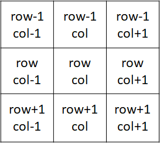

# minesweeper

# Title
## Table of Contents

- [Introduction](#Introduction)
- [Motivation](#Motivation)
- [Working](#Working)
- [Contributions](#Contributions)

<!-- toc -->

## Introduction
This program is an implementation of the popular number puzzle game Minesweeper by using recursion.

## Motivation
A friend reached out to me for help with this program. It was an old assignment for one of the courses we were both picking for the upcoming semester at university. 
Although it was not my first time with recursion, this one had me stumped. It took me a while, but I finally cracked it. And now I can play minesweeper pretty well!

## Working
The rundown of the game is as follows:  
  1. The computer generates a 2D grid, placing mines randomly across the board (1/10 probabilty of clicking on a mine)
  2. The player tries to correctly guess the locations of all the non-mines on the board.
  3. If the player guesses a location with a mine, he loses.
  4. If the player guesses a location with no mine, then he is shown the number of adjacent mines surrounding the cell he clicked.
    
      
    
  5. If the player guesses a location with no mines even in the adjacent 8 cells, the code then subsequently reveals all adjacent cells according to these rules as well. (I.e., If any of those locations are also adjacent to zero mines, they trigger a similar reaction to their adjacent cells.) 
      This is the recursive part of the code.
  6. Once the player has revealed all locations except for the mines, they win!
 
 **To run the code:**  
Fork the repo (link: (https://github.com/AparnApu/minesweeper/fork) or download/ clone it. Run the file 'minesweeper.py'. 

## Contributions
Open to contributions!

Fork the repo, edit it and commit your change.
 
